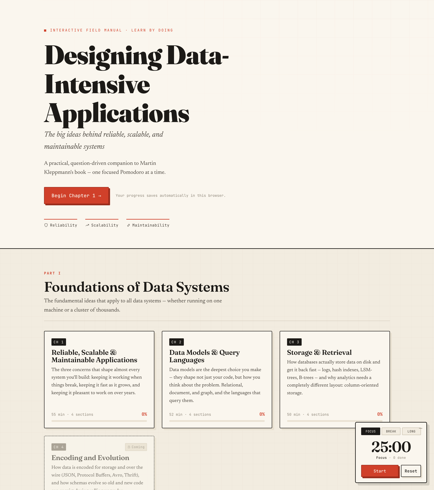
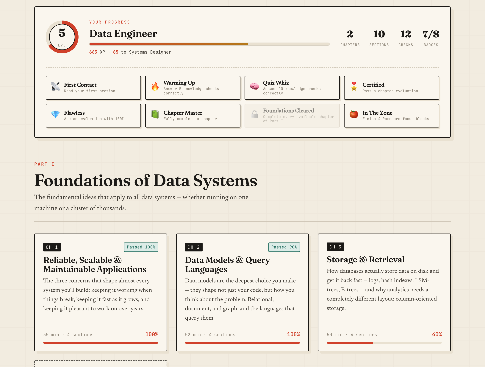
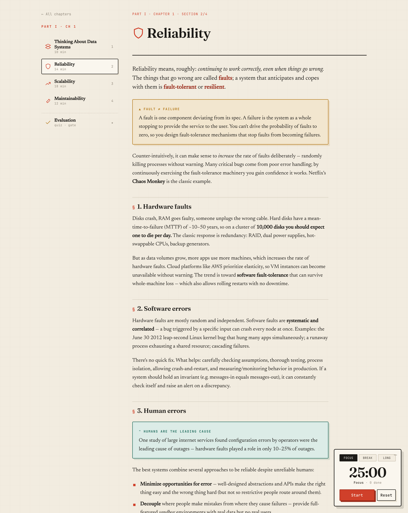
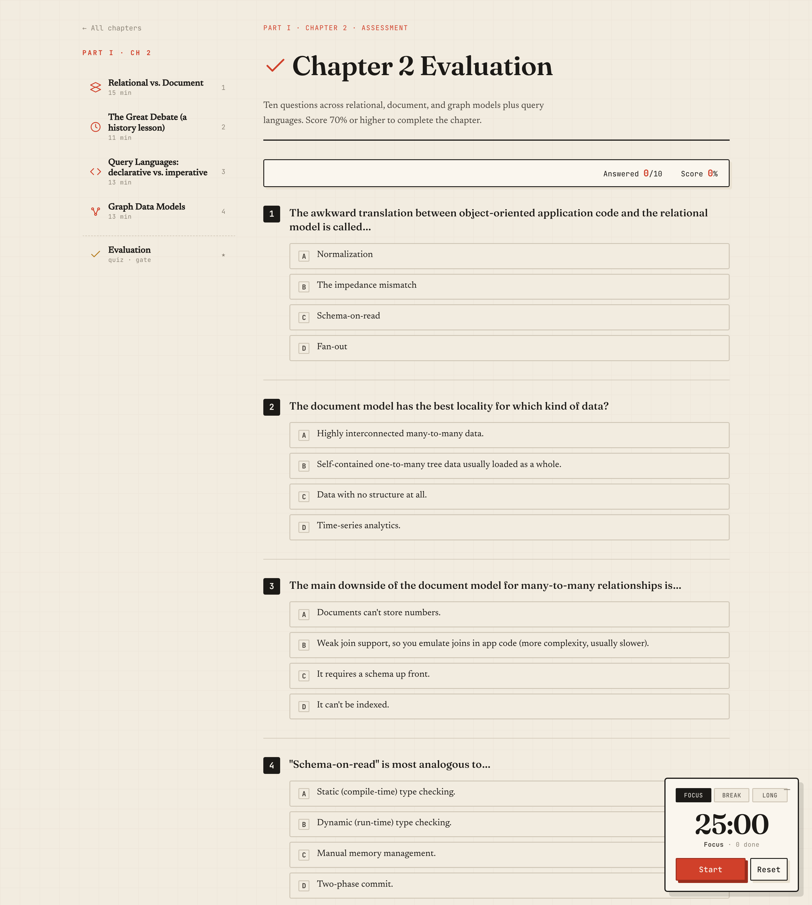
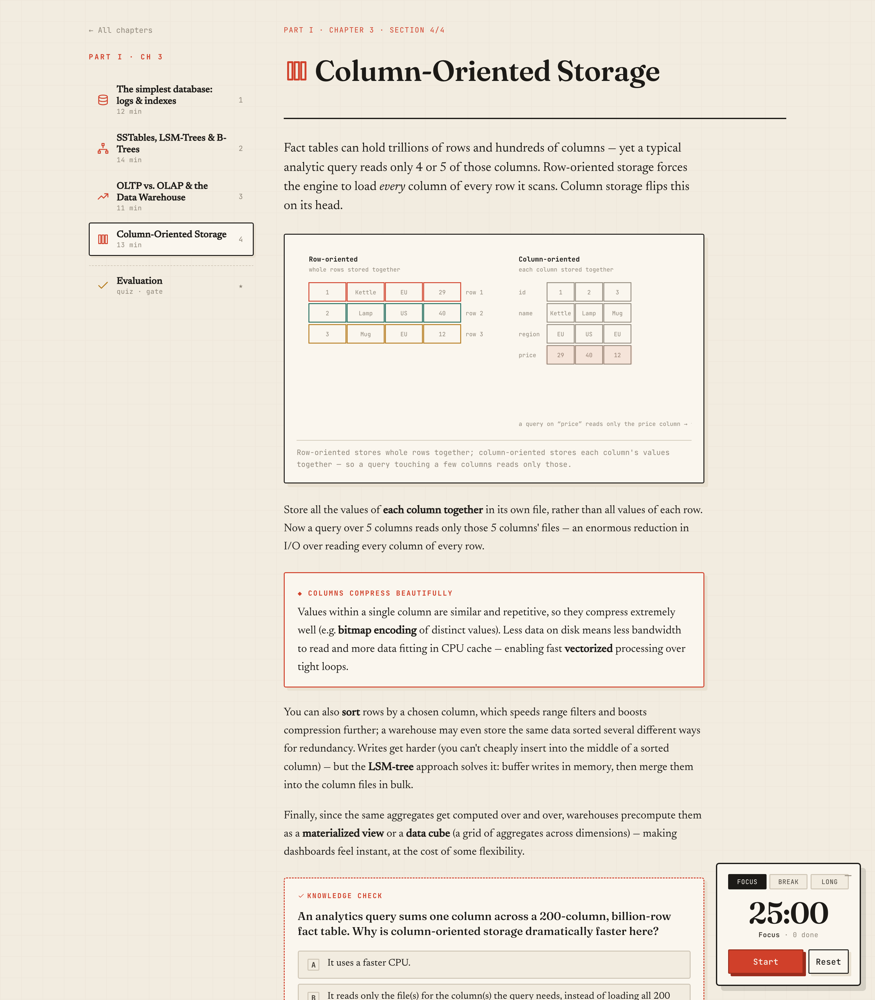

<div align="center">

# 📖 DDIA Interactive

### Learn *Designing Data-Intensive Applications* by **doing**, not just reading.

An interactive, question-driven field manual for Martin Kleppmann's legendary book —
read a focused section, answer knowledge checks as you go, prove it on an
end-of-chapter evaluation, and stay in flow with a built-in **Pomodoro** timer.

<br/>

[](https://minaonlyone.github.io/ddia-interactive/)
&nbsp;
[](https://github.com/minaonlyone/ddia-interactive/stargazers)


-1c1a17)

<br/>



</div>

---

## Why this exists

Everyone owns *DDIA*. Far fewer finish it — it's dense, and passive reading doesn't
stick. **DDIA Interactive turns the book into practice.** Every idea is paired with a
question, every chapter ends with a graded evaluation you must pass, and the whole
thing is paced by the Pomodoro technique so a 500-page mountain becomes a series of
25-minute climbs.

> If it helps you finally *finish* DDIA — and actually remember it — please
> [⭐ star the repo](https://github.com/minaonlyone/ddia-interactive). It genuinely
> helps others find it.

## ✨ Features

- 🧠 **Question-based learning** — inline knowledge checks live *inside* each section, every one with an explanation of why the answer is right (a wrong guess is still a lesson).
- 🎯 **Evaluation gate** — a graded assessment ends every chapter; score **70%+** to mark it complete.
- 🏆 **Level up as you learn** — earn **XP** for reading sections, answering checks, and passing evaluations; climb from *Curious Reader* to *Chief Data Whisperer* and unlock **badges** (Flawless, Chapter Master, Quiz Whiz…) along the way.
- 🍅 **Pomodoro, built in** — 25/5 focus cycles (long break every 4th), persistent across reloads, with a completion chime and a live tab-title countdown.
- 💾 **Content in a real database** — course material ships as a **SQLite** file (`data/course.db`) and is queried in the browser via **sql.js** (SQLite compiled to WebAssembly).
- 📈 **Progress that sticks** — sections read, checks answered, XP, level, and badges are saved in your browser (`localStorage`).
- ✍️ **Hand-drawn SVG figures** — the data-system architecture, Twitter fan-out, response-time percentiles, and row-vs-column storage diagrams, redrawn in the app's own style.
- 🗺️ **Full course map** — all three parts and every chapter are listed; chapters still in progress are clearly marked **Coming**.
- 🎨 **A design with a point of view** — an "engineering field manual" aesthetic: warm paper, ink, a single signal-red accent, and characterful type. No generic AI slop.
- ⚡ **Zero build step** — plain HTML/CSS/JS. GitHub Pages serves it as-is.

## 🏆 Turn studying into a game

Every section you read and every question you answer earns XP. Level up through ten
engineer ranks, watch your progress bar fill, and collect badges for milestones like
acing an evaluation or finishing a whole chapter — all tracked right on your home screen.

<div align="center">

</div>

## 📸 Screenshots

| Read & check as you go | Prove it with an evaluation |
| :---: | :---: |
|  |  |
| **Callouts, key terms & §-sections** | **Hand-drawn figures** |
| *insights, warnings, and real-world stories* |  |

## 🚀 Try it

**▶ [Open the live app](https://minaonlyone.github.io/ddia-interactive/)** — nothing to install.

Or run it locally:

```bash
git clone https://github.com/minaonlyone/ddia-interactive.git
cd ddia-interactive
python3 -m http.server 8123        # or: npm run serve
# open http://localhost:8123
```

> A local **server is required** (not `file://`), because the app fetches the SQLite
> database over HTTP. Any static server works.

## 📚 Course content & roadmap

Chapter 1 launched the project; Chapters 2–3 followed. The rest of the book is mapped
out and lands over time — each chapter fully authored with the same checks + evaluation.

| Part | Ch | Title | Status |
| :--- | :-: | :--- | :--- |
| **I · Foundations** | 1 | Reliable, Scalable & Maintainable Applications | ✅ Ready |
| | 2 | Data Models & Query Languages | ✅ Ready |
| | 3 | Storage & Retrieval | ✅ Ready |
| | 4 | Encoding and Evolution | 🔜 Coming |
| **II · Distributed Data** | 5 | Replication | 🔜 Coming |
| | 6 | Partitioning | 🔜 Coming |
| | 7 | Transactions | 🔜 Coming |
| | 8 | The Trouble with Distributed Systems | 🔜 Coming |
| | 9 | Consistency and Consensus | 🔜 Coming |
| **III · Derived Data** | 10 | Batch Processing | 🔜 Coming |
| | 11 | Stream Processing | 🔜 Coming |
| | 12 | The Future of Data Systems | 🔜 Coming |

## 🛠️ How it works

The app is a hash-routed single-page app with **no dependencies and no bundler**.

```
index.html          # shell + font loading
styles.css          # the "engineering field manual" theme
data/course.db      # ← all course content, as a SQLite database (shipped)
js/db.js            # loads course.db in-browser via sql.js (WASM)
js/content.js       # editable source of truth for the content
js/diagrams.js      # hand-built SVG figures
js/pomodoro.js      # the focus-timer widget
js/app.js           # router, rendering, progress, quiz engine
tools/build_db.mjs  # regenerates course.db from content.js
```

**Content pipeline:** `js/content.js` is the human-editable source. Running the build
turns it into the SQLite database the app actually loads:

```bash
npm run build:db     # content.js  ──►  data/course.db  (uses the sqlite3 CLI)
```

### Adding a chapter

1. Add a chapter object (sections → content blocks + `check` questions, plus an `evaluation`) to `js/content.js`. Change its `status` from `"coming"` to `"ready"`.
2. Add any new figures to `js/diagrams.js`.
3. Run `npm run build:db` and commit the updated `data/course.db`.

No engine code changes required — the renderer is fully data-driven.

## 🤝 Contributing

Issues and PRs are welcome — new chapters, better questions, fixes, or design ideas.
If you just want to help the project grow, the single most valuable thing you can do is
**[⭐ star it](https://github.com/minaonlyone/ddia-interactive)** and share it with
someone who's working through DDIA.

## 🙏 Credits & license

- **The book** — *Designing Data-Intensive Applications* is © **Martin Kleppmann** / O'Reilly Media. This project contains original explanatory summaries and questions written to help you learn; the book's full text is **not** included here. If you're learning from this, [buy the book](https://dataintensive.net/) — it's worth every page.
- **App code** — MIT © Mina Adel.

<div align="center">
<br/>
<em>Read a little. Answer a lot. Actually remember it.</em>
<br/><br/>
<a href="https://minaonlyone.github.io/ddia-interactive/"><b>▶ Launch DDIA Interactive</b></a>
</div>
